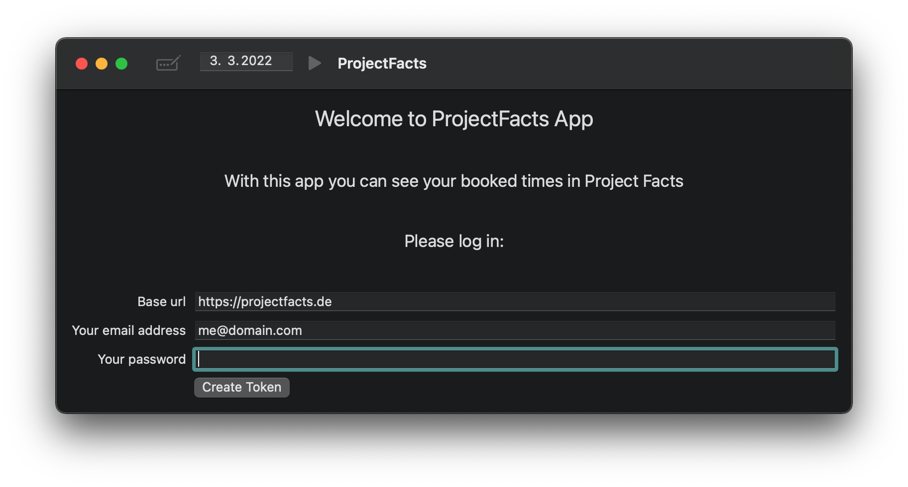
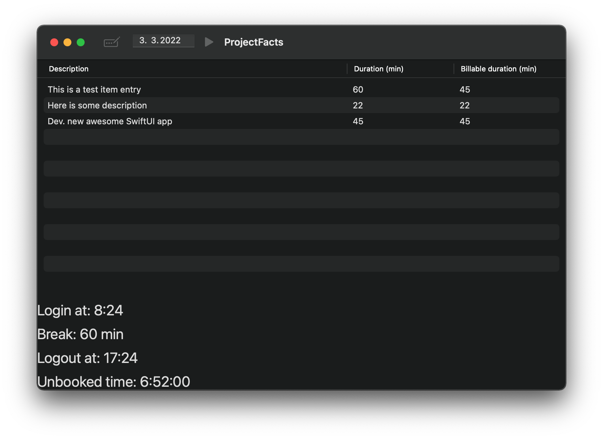

# About

This is a simple macOS app which interacts with *projectfacts.de*.

The app will display a list of all the booked times for a picked day.

There is also info about the login time, the sum value of the booked breaks, the logout date and the unbooked time. 

## Detail description

You will start with the login view

Enter the base url and your email/password to create an access token.

The main view will show a table of your booked times on the selected date.
There are also some basic login time information available

## Disclaimer

Errors which can occour when using the project facts API are currently not displayed in the app.
